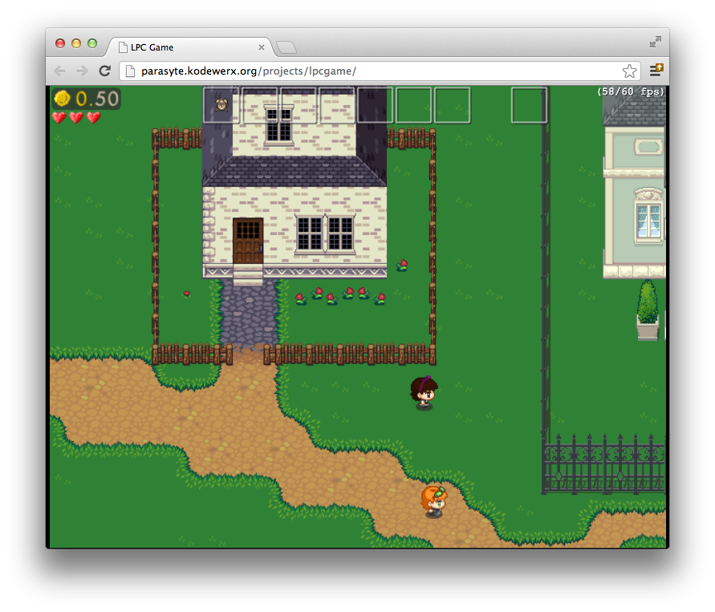
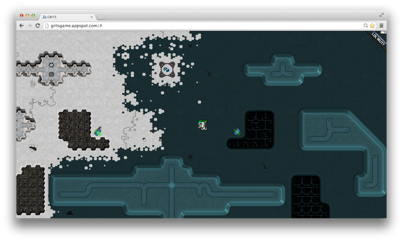

# HTML5 Open Source Games

Simple open source games that are nice and playable.

# Monk Story

DotA, [video](http://youtube.com/watch?v=HItxyniV-Es), 
[play](http://uniquevn.github.io/CraftyGame/), 
[sources](http://github.com/uniquevn/CraftyGame), JavaScript & CraftyJS.

# Eat them all

Tower Defense / RTS, <s>play</s> (it's not available online, you need to download 
and run it locally), [video](http://youtube.com/watch?v=uqMBX9mxZQo),
[sources](https://github.com/Chinow/Eat-them-All), JavaScript & CraftyJS.

# Browser Quest

MMO RPG, [play](http://browserquest.mozilla.org), 
[video](http://youtube.com/watch?v=kYcNJQ3Y6Sg),
[sources](http://browserquest.mozilla.org), JavaScript.

# Fantasy Map Tactics

Simple TBS prototype, [play](http://mcfunkypants.com/LD24/jam/), 
[sources](http://mcfunkypants.com/2012/fantasy-map-tactics), JavaScript.

# HTML5 Tower Game Starter Kit

Tower Defense, [play](http://mcfunkypants.com/Peasants),
[video](http://www.youtube.com/watch?v=01xNz6NSOFs), 
[site](http://mcfunkypants.com/tower), 
[tutorial](http://mcfunkypants.com/tower/tutorials.html), 
[sources](view-source:http://mcfunkypants.com/Peasants), JavaScript.

# Neverwell Moor

RPG, <s>[play](http://parasyte.kodewerx.org/projects/lpcgame)</s> (the site is currently down, you 
need to download and start it by yourself), 
[video](http://youtube.com/watch?v=JagSFQOMyQc),
[sources](https://bitbucket.org/parasyte/neverwell-moor), JavaScript & MelonJS.

# Grits

2D Shooter,
<s>[play](http://gritsgame.appspot.com)</s> (currently there's some minor error on the site that
prevents from playing it, but I played it earlier, it was in working state), 
[video](https://www.youtube.com/watch?v=F3JeV756B7w)
[sources](https://code.google.com/p/gritsgame), 
[tutorial](https://www.udacity.com/course/cs255), JavaScript.

*You may also be interested in [simple JS toys](../2013/interesting-toys-for-learning) 
with short and clean sources that may be useful for learning without taking too much time.*

By [Alex Craft](http://alex-craft.com)

- Tags : Game, HTML5, Open Source
- Date : 2012/11/1