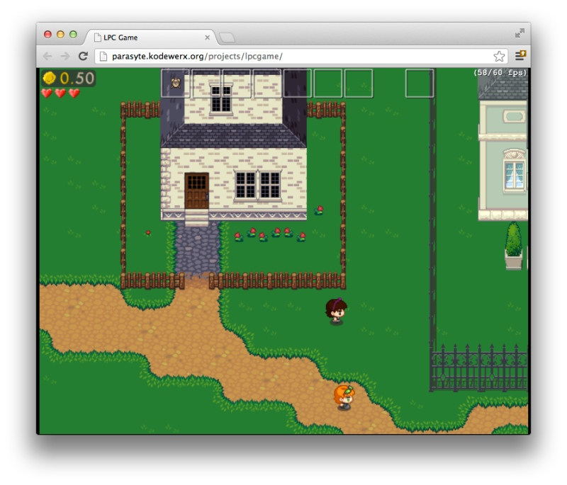

# HTML5 Open Source Games

## [Grits](http://gritsgame.appspot.com)

Top down 2D shooter made by Google to demonstrate possibilities of HTML5 for gaming.
You can [play it](http://gritsgame.appspot.com) take
[learning course](https://www.udacity.com/course/cs255) made by Google and Udacity
or [checkout sources](https://code.google.com/p/gritsgame/).

## [Browser Quest](http://browserquest.mozilla.org)

MMO RPG from Mozilla Experiment, [open source](https://github.com/mozilla/BrowserQuest),
you can [play it here](http://browserquest.mozilla.org).

## [Neverwell Moor](http://parasyte.kodewerx.org/projects/lpcgame)

RPG from [Liberated Pixel Cup](http://lpc.opengameart.org), built with HTML5 and MelonJS,
[open source](https://bitbucket.org/parasyte/neverwell-moor), there's also
[short post from author](http://opengameart.org/forumtopic/neverwell-moor-html5-game-progress-thread)
and [video overview](http://www.youtube.com/watch?v=JagSFQOMyQc).

## [Monk Story](http://uniquevn.github.com/CraftyGame)

RPG / DotA like from [Liberated Pixel Cup](http://lpc.opengameart.org), built with HTML5
and CraftyJS, [open source](http://github.com/uniquevn/CraftyGame), there's also
[short post form author](http://opengameart.org/forumtopic/monk-story)
[video overview](http://www.youtube.com/watch?v=HItxyniV-Es).

## [Eat them all](https://github.com/Chinow/Eat-them-All)

TD / RTS built with CraftyJS, [open source](https://github.com/Chinow/Eat-them-All),
[video overview](http://www.youtube.com/watch?v=uqMBX9mxZQo).

## [Liberated Pixel Cup](http://lpc.opengameart.org)

[Documentation](http://lpc.opengameart.org/static/lpc-style-guide/index.html)
[demo](http://lpc.opengameart.org/static/lpc-style-guide/demo.html),
[source of demo](https://gitorious.org/liberated-pixel-cup) and
[video overview](http://www.youtube.com/watch?v=K8mW2th7-H0)

## EmberWind

Platform game from Opera Experiment, [open source](https://github.com/operasoftware/Emberwind)
and [playable](http://operasoftware.github.com/Emberwind).

<object width="640" height="390">
  <param name="movie" value="http://www.youtube.com/v/5hZeTKaHsC8?version=3&hl=en_US"></param>
  <param name="allowFullScreen" value="true"></param>
  <param name="allowscriptaccess" value="always"></param>
  <embed src="http://www.youtube.com/v/5hZeTKaHsC8?version=3&hl=en_US" type="application/x-shockwave-flash" width="640" height="390" allowscriptaccess="always" allowfullscreen="true"></embed>
</object>

By [Alexey Petrushin](http://petrush.in)

# Attributes

- Tags : Game, HTML5
- Date : 2012/11/1