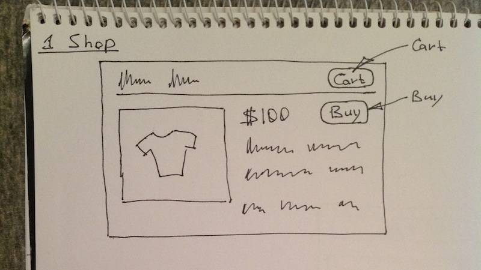

# Create simple shop.

In [this course](/projects/salejs) we create cart-widget that can be
embedded into sites in order to allow its users to buy products and send
orders to the site owner.

You'll learn how to:

- Quickly prototype User Interface with Twitter Bootstrap.
- Build REST API using NodeJS.
- Use REST API in Browser with JavaScript.
- Keep markup and code clean using Client Side Templates.
- Simplify CSS styling using Browser live refresh.
- Create dynamic Forms with JavaScript and validate it.
- Instant reaction UI without blocking, waiting and progress.

Drawing UI

[Continue...](/projects/salejs)

# Attributes

- Tags : Learning, Prototype, JavaScript, CSS, HTML, NodeJS
- Date : 2013/11/13