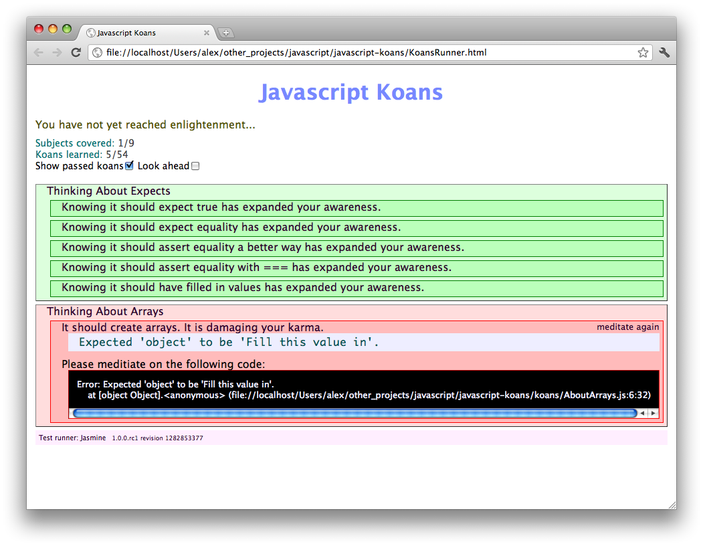

# Interesting resources for learning

Meditate on [JavaScript](https://github.com/mrdavidlaing/javascript-koans) or
[CoffeeScript](https://github.com/sleepyfox/coffeescript-koans) Koans to improve Your skills.

Play with [Conway's Game of Life](http://willbailey.name/conway/index.html) and it's
[source code](http://willbailey.name/conway/docs/conway.html) (in CoffeeScript). Sources is very
small and have detailed annotations.

Or with [maze building algorithms](http://www.jamisbuck.org/presentations/rubyconf2011).

Play with [Simple Canvas Game](http://www.lostdecadegames.com/how-to-make-a-simple-html5-canvas-game)
and investigate its source code (about two pages of JavaScript).

Examine [interactive graphics](http://bl.ocks.org/mbostock) made with D3. While examples itself are
usually small, understanding it requires knowledge of JavaScript and D3.

By [Alexey Petrushin](http://petrush.in)

# Attributes

- Tags : CoffeeScript, Learning, Resources
- Date : 2013/1/12