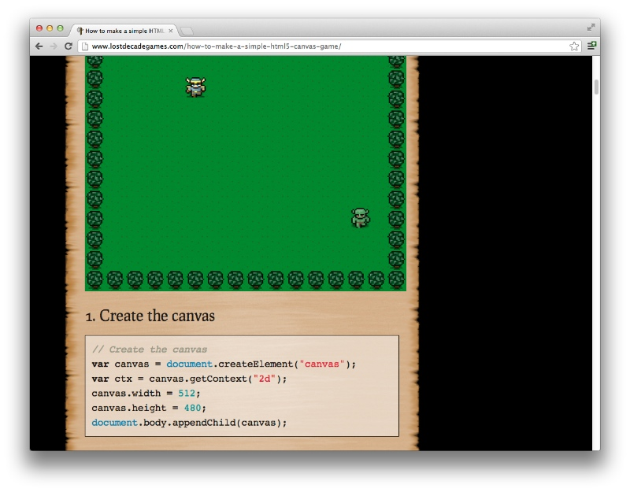
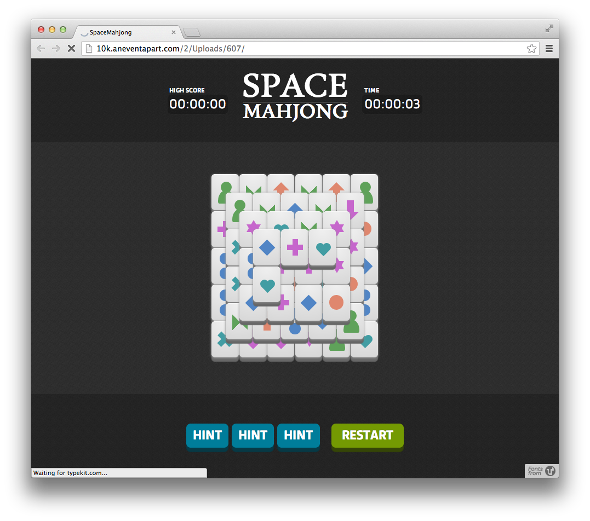
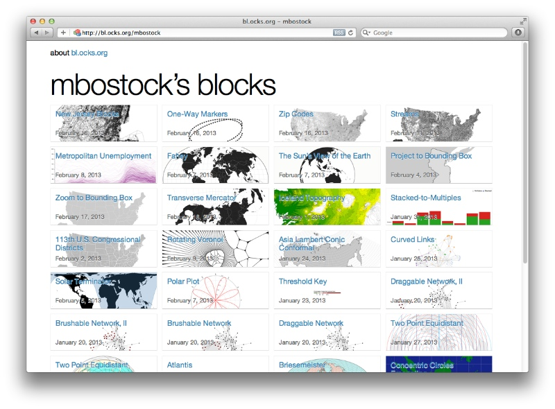
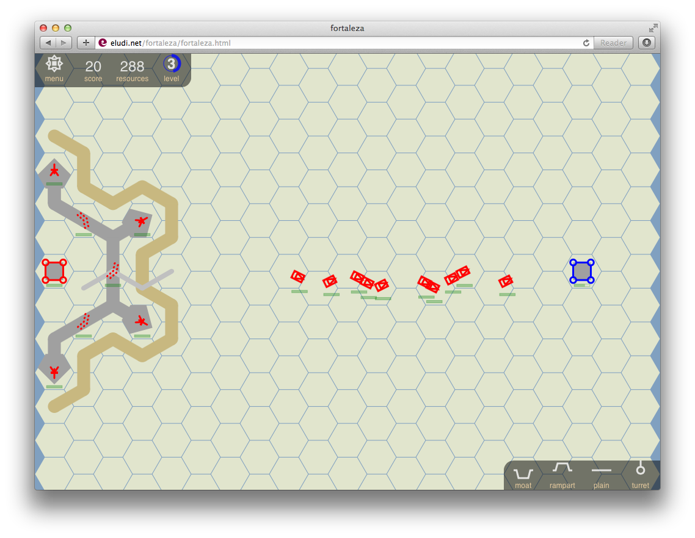
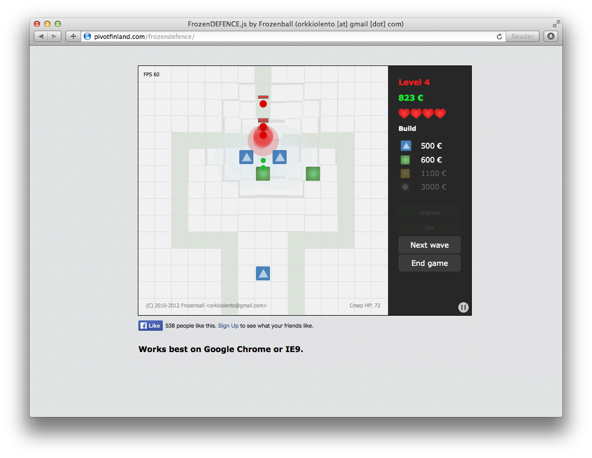
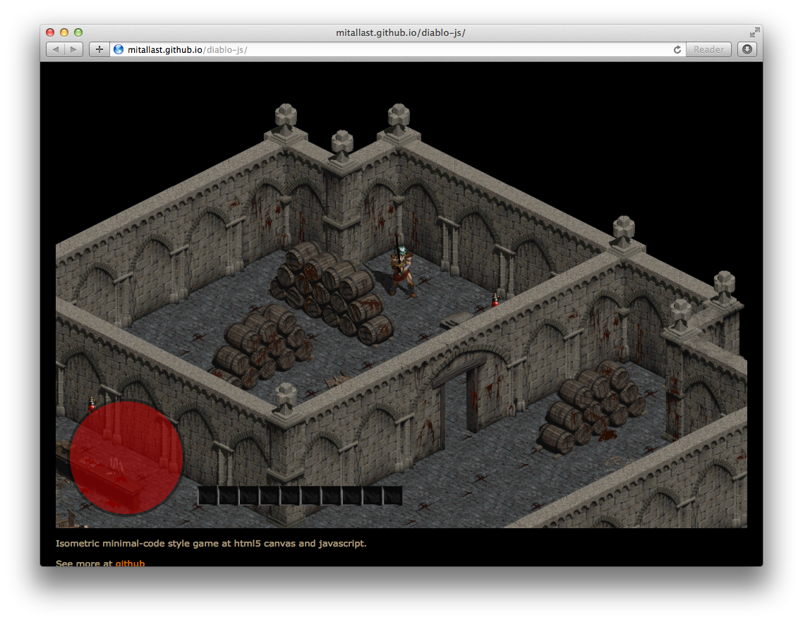

# Interesting toys for learning

Play [Simple Canvas Game](http://www.lostdecadegames.com/how-to-make-a-simple-html5-canvas-game)
and investigate its source code. It's about two pages of JavaScript with detailed explanations.

[Space Mahjong](https://web.archive.org/web/20121025152332/http://10k.aneventapart.com/2/Uploads/607) 
a simple Card Game (there's no dedicated repository for sources, but you can see it in the browser).

Or watch presentation about exploration of 
[maze building algorithms](http://www.jamisbuck.org/presentations/rubyconf2011).

[Conway's Game of Life](http://willbailey.name/conway/index.html) and it's
[source code](http://willbailey.name/conway/docs/conway.html) (in CoffeeScript). Sources is very
small and have detailed annotations.

[Interactive graphics](http://bl.ocks.org/mbostock) made with D3, lots of different 
examples. While examples itself are usually small, understanding it requires some knowledge of 
JavaScript and D3. Don't use it if you just starting learning JavaScript.

<!--
[Fortaleza](http://eludi.net/fortaleza/fortaleza.html) strategy game, examine and modify 
its sources (there's no dedicated repository for sources, but you can see it in the browser).

-->

[Frozen Defence](http://pivotfinland.com/frozendefence) simple Tower Defence game, play it or
learn its sources (there's no dedicated repository for sources, but you can see it in browser).

Checkout [Diablo II in Browser](http://mitallast.github.io/diablo-js) demo, the functionality 
is limited of course, but still it's impressive how much has been done with such a small amount 
of [code](https://github.com/mitallast/diablo-js).

Some of it may look complicated, especially if you just learning JavaScript. Don't allow such 
thoughts about complexity stop you. They have been chosen specifically because of small, 
simple and clean source code. 

So, choose whatever looks interesting to you, **open its source code** and 
work with it. Try to **alter it** or **made something similar**. It would take just a couple 
of hours or days and can **improve you JS skills** significantly.

*If you are just learning JS, you may also choose to [start from basics](learning-javascript) first and 
checkout these toys later.*

*You may also be interested in more advanced [open source HTML5 games](../2012/html5-open-source-games), 
but its source code is more complicated and requires much more time to learn.*

By [Alex Craft](http://alex-craft.com)

- Tags : CoffeeScript, Learning, Resources, Game
- Date : 2013/1/12