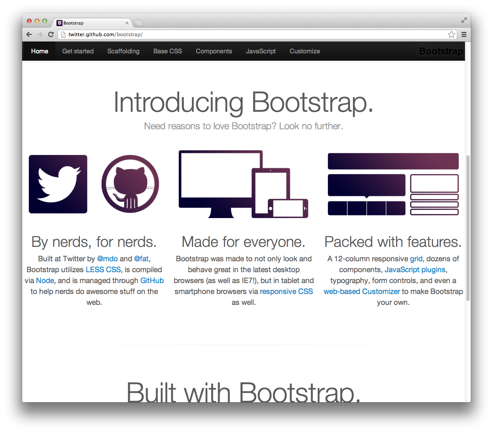
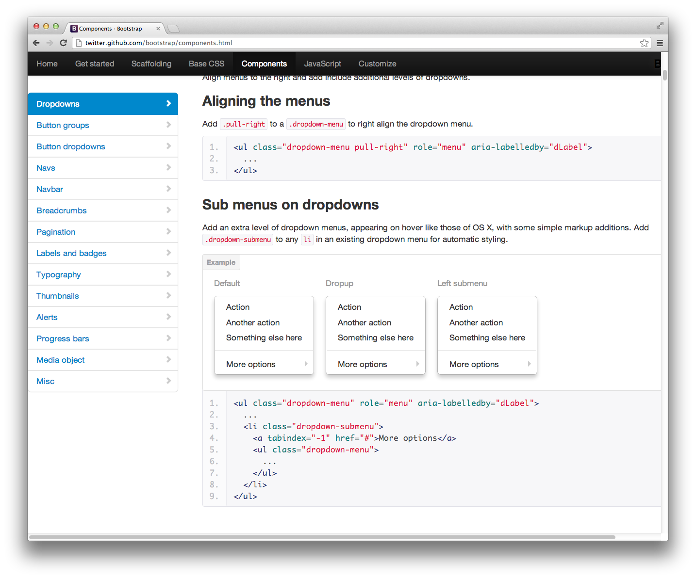
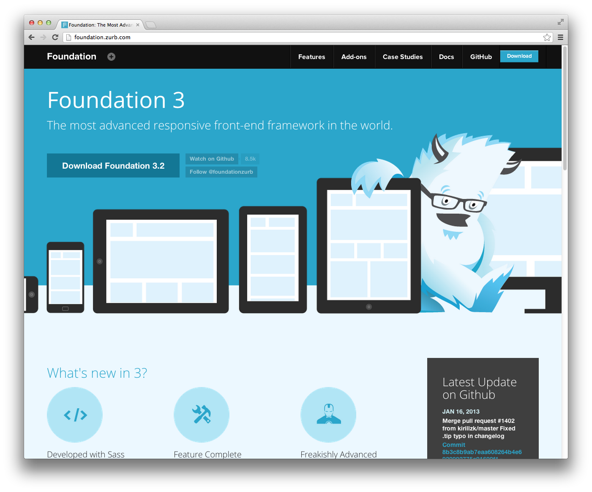
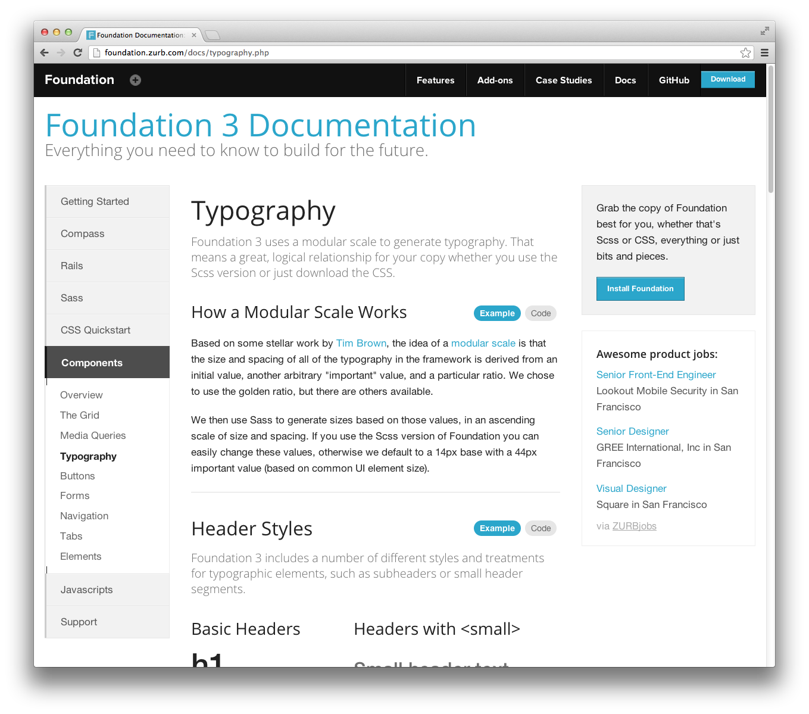

# Rapid UI prototyping

There are two very nice frameworks for quickly creating UI. Both of them have lots of features,
excellent documentation and active community.

[Twitter Bootstrap](http://twitter.github.com/bootstrap) has more components and the default
theme looks more suitable for web application than a site.

The default theme of [Zurb Foundation](http://foundation.zurb.com) on the other hand looks more
suitable for a web site than for an application.

Choose whatever You like more, both of them are good and roughly the same.

You still need to know HTML & CSS but those frameworks will greatly simplify the work,
also, its own sources are very well documented and are good way to learn new things and
improve HTML & CSS skills.

By [Alex Craft](http://alex-craft.com)

- Tags : HTML, CSS, Design
- Date : 2013/1/24