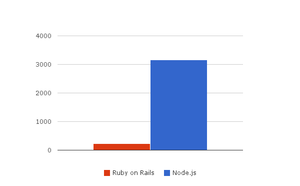

# Ruby on Rails vs Node.js

I wanted to see benchmark that more or less close to real life, not just measuring how
fast it can stream data via http.

So I created application that query some text from remote HTTP service (service
delays each request for 200ms) and render HTML page using that text.

It simulates how Web Framework performs when it needs to wait for response from DB or
other services, how fast its templating engine is and also how fast it is itself.

And hit it with `wrk -t2 -c100 -d10s http://localhost:3000` you can see results
on the picture.

3782 vs. 2914 hits, average response time is also very close.

If you want to check it by yourself take a look at
[sources and instructions](https://github.com/alexeypetrushin/web-frameworks-benchmarks)
how to run it.

**Note:** yes, it is not 10k test, it's just a common web server test, in 10k Node.js probably
would perform better than RoR. But, there are lots of situations when Node.js used for common
web applications and I wanted to see how much the performance gain in such a case.

By [Alex Craft](http://alex-craft.com)

- Tags : JavaScript, Ruby on Rails, Node.js
- Date : 2014/1/22