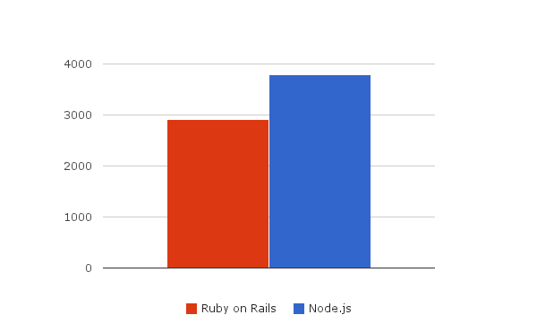

# Ruby on Rails vs Node.js

I wanted to see benchmark that more or less close to real life, not just measuring how
fast it can stream data via http.

So I created application that query some text from remote HTTP service (service
delays each request for 200ms) and render HTML page using that text.

It simulates how Web Framework performs when it needs to wait for response from DB or
other services, how fast its templating engine is and also how fast it is itself.

And hit it with `siege -b -t10s -c100 http://localhost:3000` you can see results
on the picture.

Average response time also significantly better - 1.4s vs. 0.28s.

If you want to check it by yourself take a look at
[sources and instructions](https://github.com/alexeypetrushin/web-frameworks-benchmarks)
how to run it.

## Note about development productivity

It's true that working with node.js is less productive than with Ruby on Rails, because its
API is too low level and asynchronous code is hard.

But, those issues can be solved - features similar to Ruby on Rails can be built on top of
node.js, and asynchronous code can be eliminated with Fibers.

As an example I'd like to show [Mono.js](http://monojs.org) - it's fast as Node.js and
has high level API with plain synchronous code similar to Ruby on Rails.

By [Alexey Petrushin](http://petrush.in)

# Attributes

- Tags : JavaScript, Ruby on Rails, Node.js
- Date : 2014/1/22