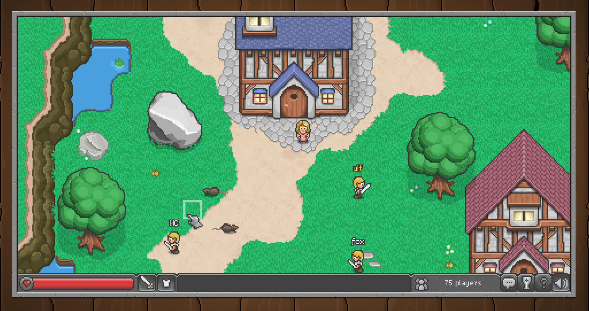

# HTML5 Open Source Games

## Browser Quest

[Play](http://browserquest.mozilla.org) [Sources](https://github.com/mozilla/BrowserQuest)

## EmberWind

<object width="640" height="390">
  <param name="movie" value="http://www.youtube.com/v/5hZeTKaHsC8?version=3&hl=en_US"></param>
  <param name="allowFullScreen" value="true"></param>
  <param name="allowscriptaccess" value="always"></param>
  <embed src="http://www.youtube.com/v/5hZeTKaHsC8?version=3&hl=en_US" type="application/x-shockwave-flash" width="640" height="390" allowscriptaccess="always" allowfullscreen="true"></embed>
</object>

[Play](http://operasoftware.github.com/Emberwind) [Sources](https://github.com/operasoftware/Emberwind)

By [Alexey Petrushin](http://petrush.in)

Tags : Game, HTML5
Date : 2012/11/1