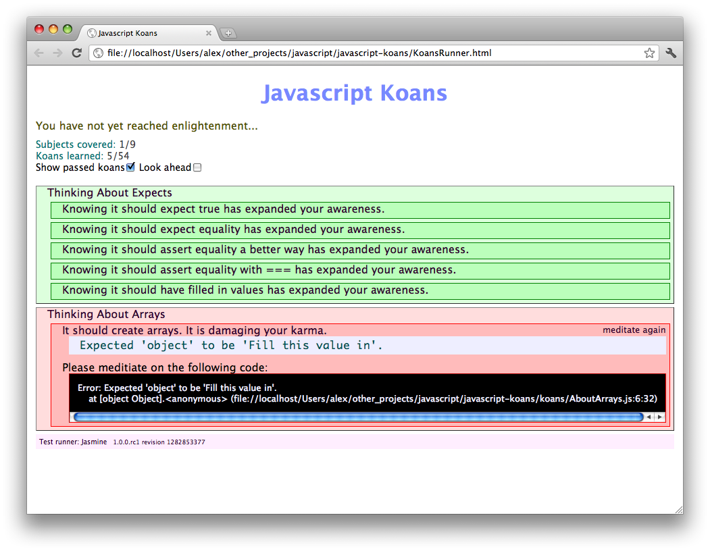
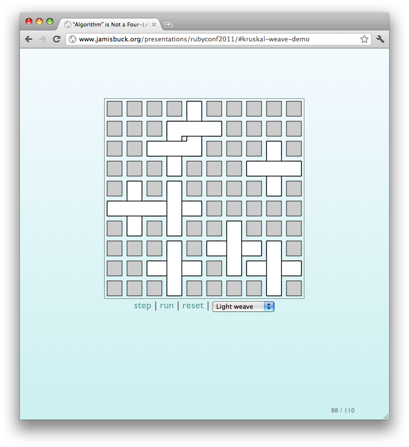

# Interesting resources for learning

Some short and interesting resources to play with:

## [Koans](https://github.com/mrdavidlaing/javascript-koans)

## [Mazes](http://www.jamisbuck.org/presentations/rubyconf2011)

Tags : CoffeeScript, JavaScript, Learning, Resources
Date : 2011/12/1