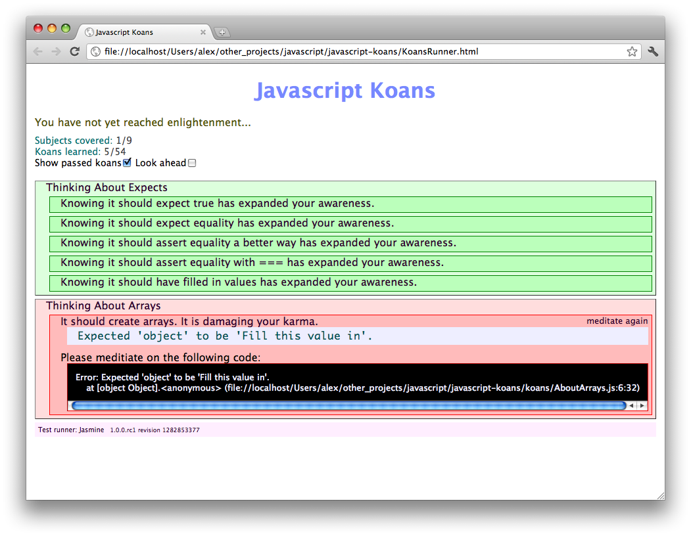
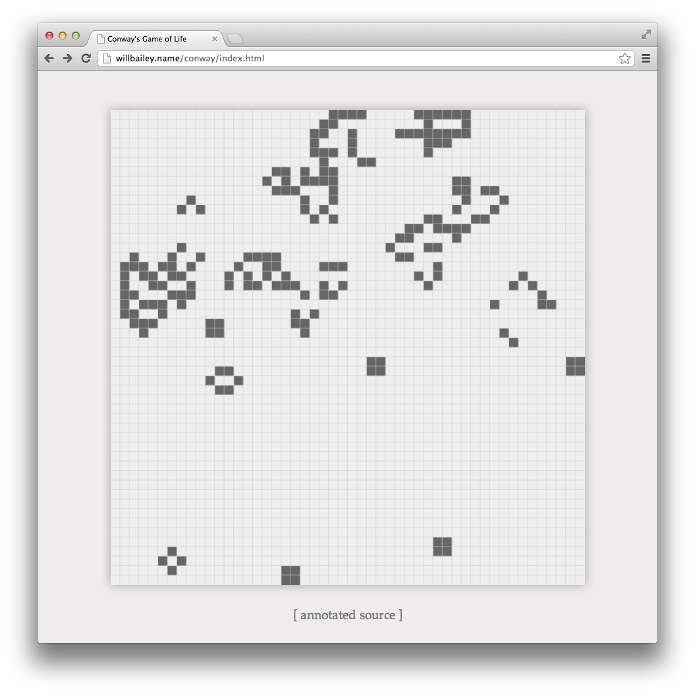
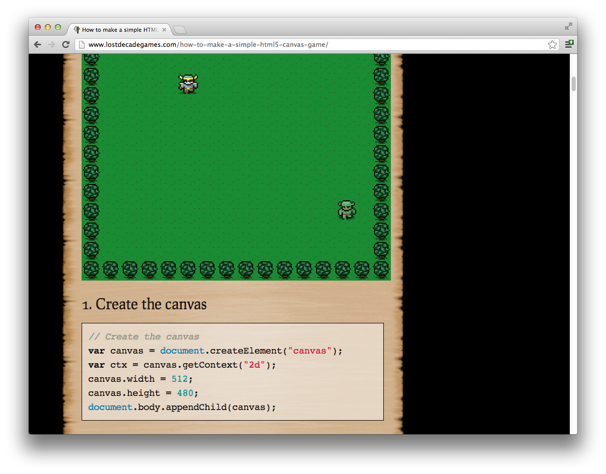

# Interesting resources for learning

Meditate on [JavaScript](https://github.com/mrdavidlaing/javascript-koans) or
[CoffeeScript](https://github.com/sleepyfox/coffeescript-koans) Koans to improve Your skills.

Play with [Conway's Game of Life](http://willbailey.name/conway/index.html) and it's
[source code](http://willbailey.name/conway/docs/conway.html) (in CoffeeScript). Sources is very
small and have detailed annotations.

Or with [maze building algorithms](http://www.jamisbuck.org/presentations/rubyconf2011).

Play and investigate source code (about two pages of JavaScript) of the
[Simple Canvas Game](http://www.lostdecadegames.com/how-to-make-a-simple-html5-canvas-game).

By [Alexey Petrushin](http://petrush.in)

Tags : CoffeeScript, Learning, Resources
Date : 2011/12/1