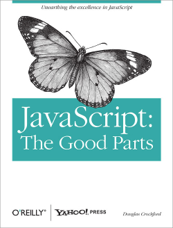
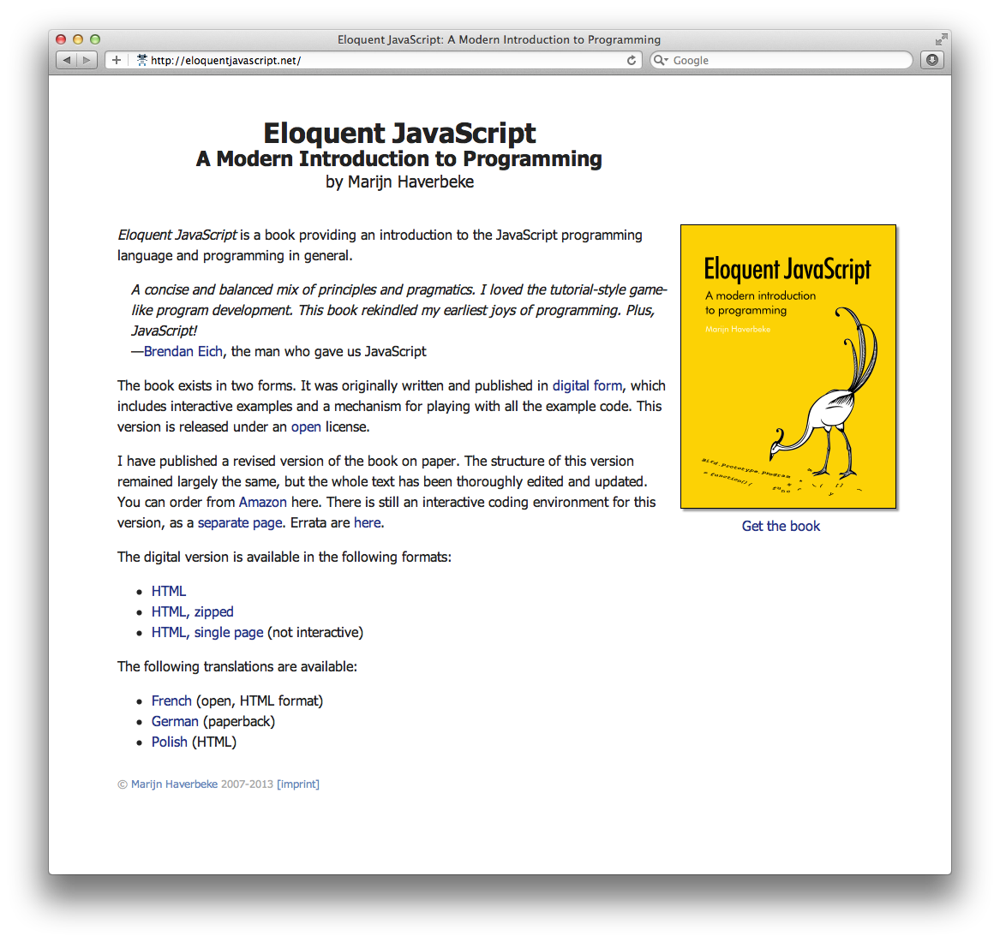

# Learning JavaScript

Learning JavaScript is both interesting / easy and boring / hard at the same time. It's
interesting because it's a nice and powerful language and hard because it has
[deadly flaws and misconceptions](misunderstanding-of-javascript).

There are also adjacent technologies that usually confused with JavaScript, let's make
it clear:

- JavaScript - the language itself, also has official but less known name - ECMAScript.
- HTML / XHTML - markup language for creating web pages (there's also CSS).
- DOM (Document Object Model) - Browser JavaScript API for working with web pages.
- AJAX, XHR - Browser JavaScript API to communicate with Server.

Most learning resources mix those technologies. It's ok if the goal is to quickly add some
interaction to web page, but it makes it harder to learn more complex stuff.

Big advantage of JavaScript is that it's forgiving - it allows you to start without having good
understanding of the language. But if you want to be efficient - you need to know the language
itself, take a look at one of books below.

[JavaScript: The Good Parts](http://www.amazon.com/JavaScript-Good-Parts-Douglas-Crockford/dp/0596517742)

[Eloquent JavaScript](http://eloquentjavascript.net)

Also, spent some time meditating on [Koans](https://github.com/mrdavidlaing/javascript-koans) or
playing with [interesting projects](interesting-resources-for-learning).

After you read the book and have some experience good way to continue is to examine
sources of some of [real projects](https://github.com/languages/JavaScript/most_watched).

By [Alexey Petrushin](http://petrush.in)

Tags : CoffeeScript, Learning, Resources
Date : 2013/2/18