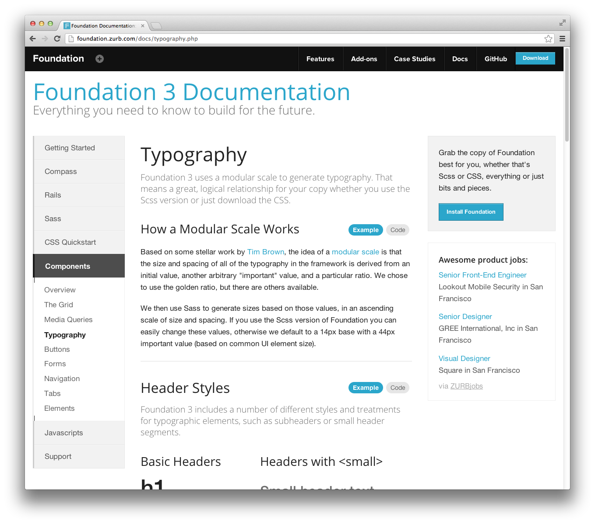

# Rapid UI prototyping

There are two very nice frameworks for quickly creating UI. Both of them have lots of features,
excellent documentation and active community.

[Twitter Bootstrap](http://twitter.github.com/bootstrap) has more components and the default
theme looks more like an web application.

Default theme of [Zurb Foundation](http://foundation.zurb.com) looks more like a web site.

You still need to know HTML & CSS but those frameworks will greatly simplify the work,
also, its own sources are very well documented and are good way to learn new things and
improve HTML & CSS skills.

Tags : HTML, CSS, Design
Date : 2013/1/24