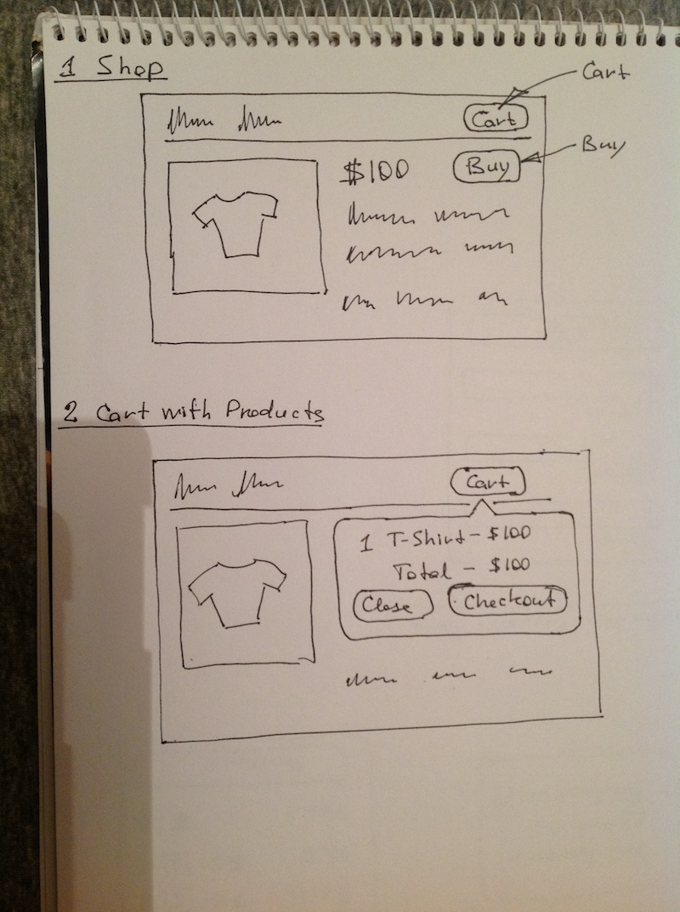
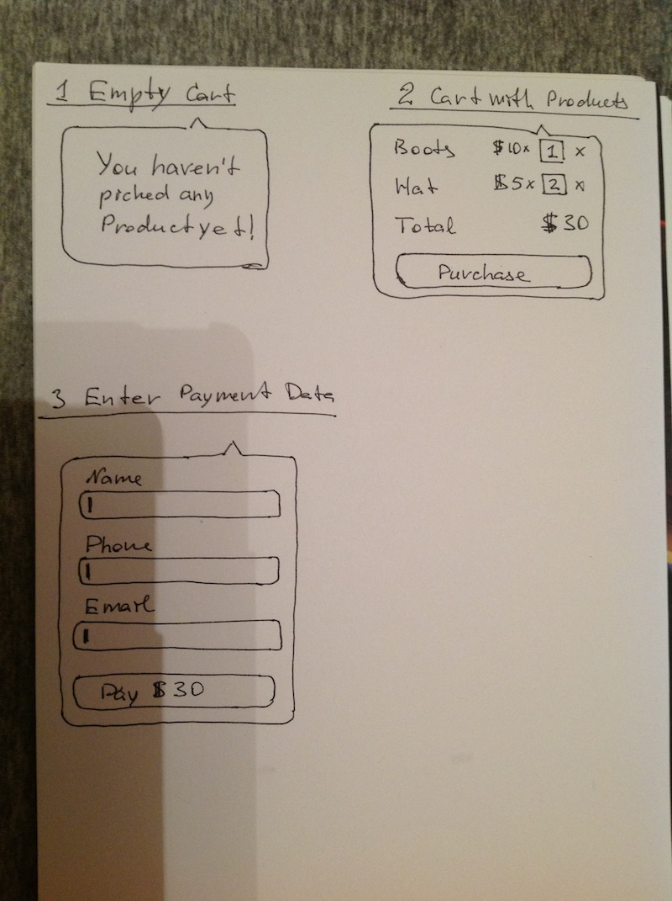

# Drawing UI

Take blank page and pen and draw skeleton of your application, don't draw details
draw only the big features.

Drawing simple shop without Cart Widget and with Cart Widget opened.

Drawing different states of Cart Widget.

- Date  : 2013/11/21