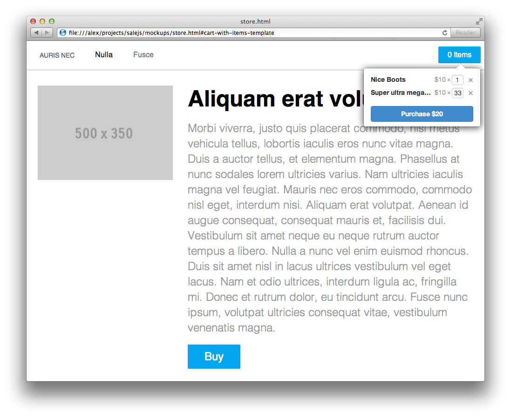
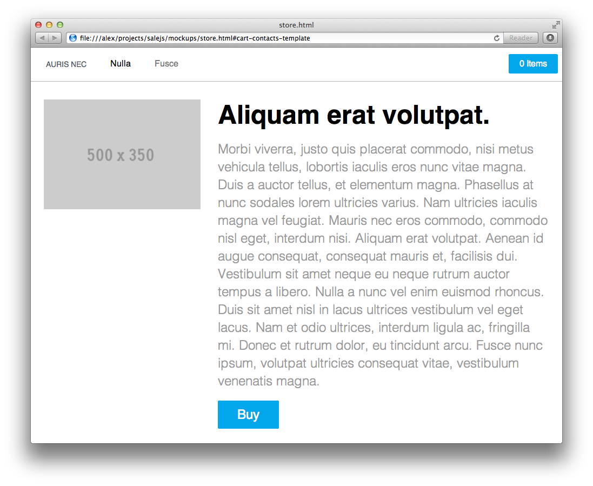
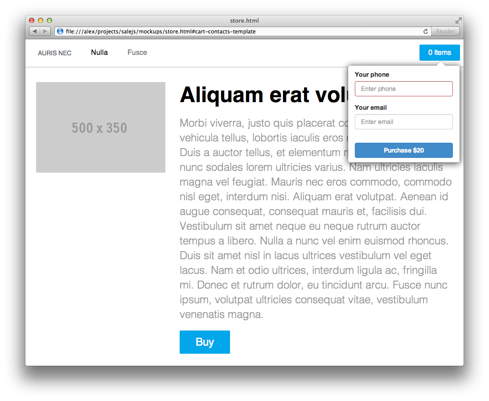
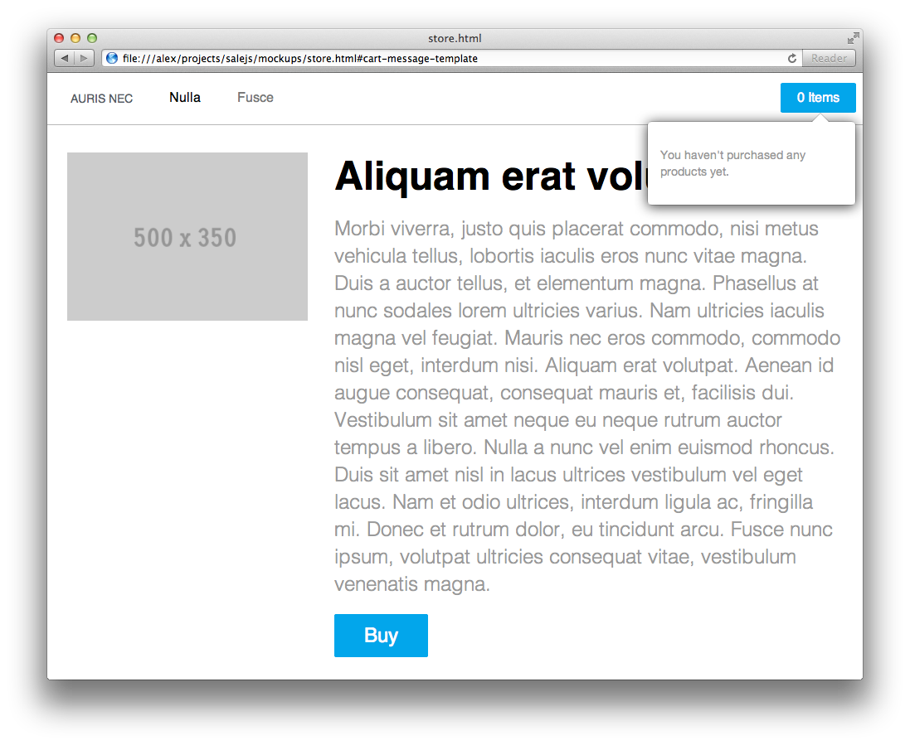

# HTML Mockups

I will use Twitter Bootstrap styles for the first version of the project. We'll
create HTML & CSS mockups of Cart Widget.

Strictly speaking it's not very good choice because JS and CSS resources that
come with Bootstrap weights a lot and require jQuery. And because
our Cart Widget should be embeddable in variety of different sites and be small
and fast it's not a good thing. Creating it from the scratch and using native
DOM API would be a better choice.

But, there's a huge reason for using Bootstrap - because I need to test my
idea about this Cart Widget **as quick and cheap as possible** and Bootstrap
allows me to do it.

Maybe when I build it it will turn out to be a lame project nobody cares about.
If so - I just forgot it and move along, assuming I didn't invest in it
too much it won't be a huge loss. And if it turns out to be a good idea -
no problem also - I'll just refactor it - remove Bootstrap, jQuery and implement
it to be small and fast with native JavaScript and nice hand-crafted styles.

So, for the first version we will rely on Twitter Bootstrap.

## Steps

1 Preparing empty project.

2 Creating simple shop to use as a stub for our widget using styles from
http://purecss.io.

Actually we can use styles from Bootstrap for both Shop and Cart but
the Cart is supposed to be used in any site, possibly with styles incompatibe
with Bootstrap. So, I'd like to use different styles for the Shop, not
the same from Bootstrap, in order to work in alien styles environment
from the start.

3 Putting Bootstrap styles under the namespace, see `readme` for details.

We can't use Bootstrap styles directly because our Cart Widget should be
able to be used in any site without breaking its styles. To do it we need to put
Bootstrap styles under the namespace.

4 Creating HTML & CSS mockups.

Usually it's better to start from the visual appearance of application. I want to
see something real as quick as possible without bothering with complex JS behaviours
or servers.

It's important to get mockups first, after all maybe our idea for this project may
not be very good, and after looking at it we will decide to discontinue it. If so
our expenses and time spent will be minimal. If otherwise we start fully developing
it without creating mockups first and only later discovered that our idea wasn't so
greet and decided to discontinue - our cost would be much bigger.

Cart with Items

Contact Form

Cart Message

7 Pushing project to GitHub.

An optional step, but I usually like to keep the history of the project and have
backups, so if my local machine will crash I won't loose my work.

You can see the result in the [project repository](https://github.com/alexeypetrushin/salejs)
marked with `html-mockups` tag.

## Screencast

<iframe width="853" height="480" src="//www.youtube.com/embed/TilcurMfDcA" frameborder="0" allowfullscreen></iframe>

- Date  : 2013/11/23